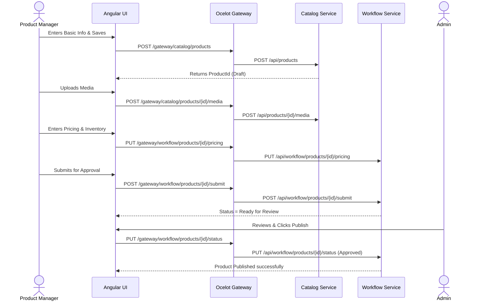

# Sequence Diagram: Add Product -> Publish Flow

```mermaid
sequenceDiagram
    actor PM as Product Manager
    participant UI as Angular UI
    participant GW as Ocelot Gateway
    participant Cat as Catalog Service
    participant WF as Workflow Service
    actor Admin as Admin

    PM->>UI: Enters Basic Info & Saves
    UI->>GW: POST /gateway/catalog/products
    GW->>Cat: POST /api/products
    Cat-->>UI: Returns ProductId (Draft)
    
    PM->>UI: Uploads Media
    UI->>GW: POST /gateway/catalog/products/{id}/media
    GW->>Cat: POST /api/products/{id}/media
    
    PM->>UI: Enters Pricing & Inventory
    UI->>GW: PUT /gateway/workflow/products/{id}/pricing
    GW->>WF: PUT /api/workflow/products/{id}/pricing
    
    PM->>UI: Submits for Approval
    UI->>GW: POST /gateway/workflow/products/{id}/submit
    GW->>WF: POST /api/workflow/products/{id}/submit
    WF-->>UI: Status = Ready for Review

    Admin->>UI: Reviews & Clicks Publish
    UI->>GW: PUT /gateway/workflow/products/{id}/status
    GW->>WF: PUT /api/workflow/products/{id}/status (Approved)
    WF-->>UI: Product Published successfully
```
